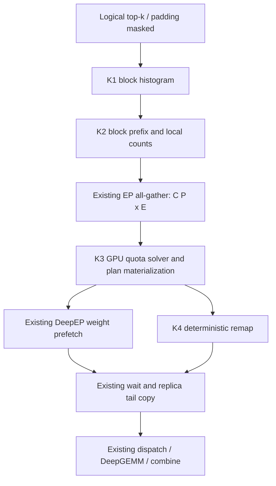

# Online EPLB GPU Planning 设计

2026-10-08 决策更新：仅保留 GPU planning，删除 CPU planning/回滚路径及本次相关测试代码（含 CPU reference、runtime/kernel tests 和 benchmark 脚本）。下文验收指标是行为与性能要求，不表示仓库保留对应测试实现或已完成硬件验证。

| 项目 | 内容 |
| --- | --- |
| 状态 | 设计草案；尚未实现或进行 GPU 验证 |
| 日期 | 2026-10-07 |
| 关联设计 | [Online EPLB 总体设计](DESIGN-online-expert-balancing.md) |
| 主要参考 | UltraEP `94cab099b44fffa99a82fea99e7c12d89cf65e4f` |
| 首要目标 | 将当前 balance planning 移到 GPU，消除 counts D2H、Python greedy 和 plan H2D |
| 完整交付边界 | GPU 统计/规划、device `BalancePlan`、消费该 plan 的确定性 GPU remap |

## 1. 决策摘要

采用 UltraEP 的 **GPU quota solver + 固定容量设备计划** 思路，保留当前 SGLang manager、DeepEP v2.5 权重预取、FP8 dispatch 和 DeepGEMM。首版不引入 UltraEP Manager、NVSHMEM 或新的权重通信库。

规划输出从 `redundancy_mapping + source_prefix + Python transfers` 改为固定容量 GPU tensors：副本位置、每个 logical expert 的实例 physical IDs，以及实例 quota 的累积上界。所有有效长度均由 GPU 消费，Python 只使用静态 shape/config，不读取设备结果决定执行分支。

仅替换 `_greedy_plan` 不足以完成该目标：当前 `transfers` 是 Python list，重映射还要遍历它。此次设计包含最小必要的 GPU consumer 改造，防止为了兼容旧 consumer 又把 GPU plan 读回 CPU。

默认保持稳定的 `(source rank, token index, top-k column)` ordinal。借鉴 UltraEP 的 quota 数据模型，不采用其 sparse reroute 的 atomic ordinal 顺序。规划策略会从旧的平方负载差 greedy 变为 threshold/quota heuristic，因此不要求与旧算法生成相同 placement；要求逻辑路由、配额守恒和数值语义正确。

## 2. 问题依据与本次范围

已提供的四 rank trace 来自 Qwen3-235B-A22B FP8、4×H20、TP=EP=4。实际采样为一次 `bs=1/toks=4096` prefill 和四次 decode，不是 benchmark 表格的 1024→256。rank 0 的 94 层中，`plan` 的 CPU inclusive 时间为 120.00 ms，其中 `_greedy_plan` 为 76.26 ms；online remap 的 CPU inclusive 时间为 141.08 ms，发射 7,816 个 kernel。stack/shapes profiling 会放大主机端开销，以上数值仅作为定位证据，不是预计可回收的非 profile 延迟。

本次要消除的具体路径：

```text
counts.sum(...).cpu().tolist()
    -> Python candidate search
    -> torch.tensor(mapping, device="cuda")
    -> Python transfers loop
```

本次不改权重池、M+R slab、预取 stream、dispatch 前的 wait/copy、GEMM、prefill graph 开关、TBO/SBO 或多域约束。权重传输和尾部 DtoD 仍会存在。GPU planner 本身具备 capture 所需的固定地址/设备控制流，不等于整个 prefill 已支持 CUDA graph。

本设计具体化总体设计中的 M2；涉及 planner 算法、`BalancePlan` 和 reroute 的描述以本文为准，其他生命周期、权重格式与编号合同沿用总体设计。

## 3. 如何参考 UltraEP

| UltraEP 实现 | 本设计采用 | 本设计差异 |
| --- | --- | --- |
| `update_placement_sparse`：GPU histogram、collective、device solve | 设备计数和规划 | 继续使用现有 EP/TP process group 的 all-gather，不接 NVSHMEM |
| `quota_placement_solve_kernel`：目标 rank load、quota、容量约束 | 阈值驱动的构造式求解 | 首版聚焦单域 P≤8；不引入 relay、训练状态和完整 manager |
| `logical_to_physical`、quota prefix | 固定容量 plan | 采用全局稳定 ordinal；首版不做源 rank locality quota decomposition |
| sparse reroute 的一次 CUDA 重映射 | 用少量 kernel 消费 device plan | 用 block histogram/prefix 保持稳定 ordinal，而非 `atomicAdd` 顺序 |
| fast oracle 的动态 quota floor | 不照搬 | 配置的最小 quota 在每个求解分支均是硬约束 |

UltraEP 的 forward planning/weight sync 也暴露在关键路径。此次验收以降低这段控制开销为目标，不以前向权重传输完全隐藏为前提。

参考是固定 commit 的算法和实现，不声称结果与 UltraEP bitwise 相同。如实现时直接移植源码片段，保留其 MIT copyright/license notice 并记录来源；算法改写与直接移植在文件头区分。

## 4. 不变量与符号

| 符号 | 含义 |
| --- | --- |
| P | EP rank 数，同时是当前单 NVLink 域大小 |
| E | logical expert 数，E 必须能被 P 整除 |
| M | E/P，每 rank master 数 |
| R | 每 rank replica slot 数；维持现有配置 |
| S | M+R，每 rank physical expert 数 |
| K | 每 token routed top-k |
| C[s,e] | source rank s 真实有效路由项中 expert e 的计数 |
| G[e] | `sum_s C[s,e]` |
| N | `sum_e G[e]`，全域有效路由项数，不是单纯 token 数 |
| Qmin | `online_ep_min_tokens_per_replica`，首版保留当前默认值 1024 |
| L0[r] | owner 为 r 的 logical experts 的 G 之和 |

保留现有 ID 公式：

```text
owner(e)                = e // M
master_physical(e)      = owner(e) * S + e % M
replica_physical(r, j)  = r * S + M + j
redundancy_mapping[r,j] = logical expert e；空 slot 为 -1
```

即使无复制，也不能将 logical ID 原样传给 dispatcher。固定 master 布局、原始 top-k weights、top-k column 顺序、每条有效路由恰好执行一次均保持。

同一 expert 最多在每个非 owner rank 放一个副本；每 rank 最多 R 个副本；每个 expert 的 master+replica quotas 之和必须是 G[e]。因此每 expert 最多 P 个实例，采用 `[E,P]` 输出容量。

各 rank 获得相同 C 并独立求解。全局 plan 必须完全相同；只有 `source_prefix` 因 source rank 不同而不同。不能使用本地时序、浮点归约顺序或随机数决定 placement。

## 5. Device BalancePlan

建议在 `online_balancer.py` 保留小型 Python dataclass，仅描述已有 tensor 的视图：

```python
@dataclass(frozen=True)
class BalancePlan:
    redundancy_mapping: torch.Tensor    # int32 [P, R]
    instance_physical_ids: torch.Tensor # int32 [E, P]
    instance_quota_end: torch.Tensor    # int32 [E, P]
    instance_count: torch.Tensor        # int32 [E]
    source_prefix: torch.Tensor         # int32 [E]，本 source rank 的前缀
```

约定：

1. 实例 0 永远是 master，之后按 target rank 升序排列副本。每个 target 的 slot 按最终接收 expert ID 升序分配。求解候选顺序不暴露成输出顺序。
2. `instance_quota_end[e,i]` 是 exclusive upper bound 的累积和；有效区间右开。有效末项必须等于 G[e]。master quota 可以为 0，以兼容当前允许把一个 expert 的全部流量导出的语义。
3. 未用 ID 填 -1，未用 quota end 填 G[e]，count 包含 master，范围 `[1,P]`。零负载 expert 仍 count=1、master end=0。
4. 无副本计划：所有 mapping 为 -1，所有 count=1，master quota=G[e]；不单独输出副本总数。
5. 移除生产路径的 Python `transfers`。不保留 CPU transfer adapter。
6. Python 不执行 设备 tensor 的布尔转换、`.item()`、`.tolist()`、设备值日志格式化或动态切片。

输出空间约为 `4*(P*R + 2*E*P + 2*E)` bytes。E=128、P=4、R=4 时为 5,184 bytes/rank；不含 workspace 和诊断统计。

`BalancePlan` 是一次 MoE 调用期间有效的 borrowed view，不是历史快照。下一次 balance 可覆写同一个 plan workspace；调用者不得把它存为跨层历史对象。需要记录时使用独立的有界诊断缓冲区。

## 6. 固定工作区与类型

由 `OnlineExpertBalancer` 初始化输出及求解 workspace；manager 编排通信，保持进程组所有权。按启动时的 per-rank dispatch capacity `Tcap` 和 K 分配，不能只按当前 chunked-prefill 配置推测容量。

manager 读取 DeepEP dispatch capacity 环境配置，计算 `max_routing_entries=Tcap*K` 并传给 balancer，表示每 rank 展开后的 top-k 路由项容量。构造参数不使用 keyword-only 限制；不传 device，直接在 runner 已设置的当前 CUDA device 上分配。

主要工作区：

| 张量 | dtype / shape | 生命周期 |
| --- | --- | --- |
| local counts | int32 `[E]` | 每次统计完整覆盖 |
| gathered counts | int32 `[P,E]` | 每次 all-gather 覆盖 |
| block counts | int32 `[Bcap,E]` | 当前 Bactive 行完整覆盖 |
| block prefix | int32 `[Bcap,E]` | reduce/prefix kernel 生成 |
| candidate/best plan scratch | 定长 int32/bitset | 每次 solve 初始化 |
| plan tensors | 第 5 节 | 固定地址、借用视图 |
| physical top-k output | int64，容量 `Tcap*K` | 单个预分配 buffer，remap 输出，本层 dispatch 消费 |

`Bcap=ceil(Tcap*K/256)`；空输入使用一个全零统计 tile。示例 `Tcap=8192,K=8,E=128` 时 block counts 和 block prefix 合计 256 KiB/rank。capacity 是静态上界；只遍历当前有效 tile 数，不能读取上一调用的尾部。

初始 GPU specialization 范围：P∈{2,4,8}、E≤512、R≤8、E%P=0。它是首版 GPU 后端的实现边界，不是 online EPLB 的数学限制。超出范围的配置在初始化阶段报错，不提供 CPU 后端或逐层 fallback。

计数、配额、前缀使用 int32；启动时依据所有 rank 的 dispatch capacity 检查 `sum(Tcap_rank)*K <= INT32_MAX`。累积总量、阈值比例乘法和 shape 乘法使用 int64 中间值再检查转换，不能靠 int32 溢出后检测。超界配置初始化拒绝。

JIT 编译与 workspace 分配在 warmup 前完成。任何层、batch 切换不得引入数据依赖的 plan tensor 分配。构造 dataclass 或静态 tensor view 不算 device allocation。

## 7. 执行流水



planner 单次 launch 内分为三个逻辑阶段，每层为 **4 个本地自定义 kernel + 1 次现有 counts collective**，不含既有 padding mask、prefetch 和 MoE kernels。实现若需要额外固定次数的 memset/scan，应在 benchmark 中如实计入；不能把子操作排除来宣称只有一次 launch。

K1/K2 同时为 counts 和稳定 ordinal 提供数据，避免 histogram 和 remap 分别重做一套通用排序。

### 7.1 K1：分块 histogram

tile 大小由 Python wrapper 中的 `ONLINE_EPLB_ROUTE_THREADS_PER_BLOCK=256` 统一定义，并通过 JIT 的同名编译宏传给 CUDA。Python workspace 分块、K1/K4 的 block 大小和 K4 warp histogram 容量均由它推导；该值也参与 JIT 缓存标识。

每 block 处理固定 256 个按 row-major 展开的 top-k entries，在共享内存统计 E 个 bins，完整写出本 tile 的 block counts。只统计 `0 <= id < E` 的 entries；padding -1 不索引 histogram、不贡献 ordinal。

输入已有 top-k dtype 为 int32 或 int64，kernel 内安全转换；不为整个输入新增 `.to(int64)`。所有 rank，包括本地 T=0 的 rank，提交合法的全零统计并参与后续 collective。

### 7.2 K2：local counts 和 block prefix

沿 block 维按确定顺序 scan，每个 expert 得到：

```text
block_prefix[b,e] = sum_{u<b} block_counts[u,e]
local_counts[e]   = sum_b block_counts[b,e]
```

采用每 expert/小组 expert 一个 CTA，整型累加。Bactive 从输入 shape 得到，允许 host 使用 shape；不得从 GPU 读有效 token 值。padding 有效性仍由 K1 判定。

### 7.3 元数据 all-gather

保留 `dist.all_gather_into_tensor`，输入/输出改为预分配 int32 tensor。`async_op=False` 沿用当前 PyTorch process-group 的 stream 语义，不等于显式 GPU→CPU 同步；验证 next kernel 已在 consumer stream 正确等待 collective 完成。

首版不换 communicator，不把 all-gather 换成 all-reduce：稳定全局 ordinal 还需要每个 source rank 的 C。all-gather 的成本单独报告，GPU planner 不保证消除 collective 等待。

### 7.4 K3：GPU quota solver

K3 保持单次 `online_eplb_plan_kernel` launch，在 kernel 内划分 Prologue、PlanVerifyAndScore、Epilogue 三个逻辑阶段。固定使用单 CTA（`grid.x = 1`），默认 128 threads；内部接口支持 32/64/128 threads 的 block 配置，尚无 GPU 性能实测。

Prologue 只计算 global counts/source prefix、稳定排序索引和初始 loads。`online_eplb_plan_kernel` 在 Prologue 之后初始化 CTA 级 `SearchState`，并控制后续搜索轮次。空负载或初始负载已均衡时直接进入 Epilogue，输出 master-only。

PlanVerifyAndScore 每轮由 CTA controller 生成最多 `block.x / 32` 个不同阈值，各 warp 只执行一次 `try_plan`。第 0 轮的 warp 0 采用原快路径阈值 `first=min(UB-1, ceil(101*LB/100))`；默认其余三个 warp 同时试探 `[first, UB-1]` 跨度的 1/8、1/4、1/2 位置。整数舍入导致重复时向后调整为不同阈值，窄区间仅启用实际需要的 warp。包括第 0 轮在内，所有轮次都统一调用 `score_round`；本轮所有成功结果均参与评分，并共同收紧下一轮搜索范围，warp 0 不享有优先选择或无条件 early stop。

后续轮次在当前共同区间均匀选点；区间长度不超过 warp 数时一次枚举所有整数阈值。总预算固定为最多 16 个候选，包含第 0 轮原快路径和推测候选。128 threads 最多 4 轮，64 threads 最多 8 轮，32 threads 最多 16 轮。所有 warp 共享这份预算，不再各自执行独立搜索循环。

`WarpWorkspace` 只保留临时候选及 success 标记，CTA 只保留一个 `SearchState::best`。每轮等待全部 warp 验证完成，再按原有评分顺序归约，最多复制一次本轮 winner；复制结束后通过 CTA barrier 开始下一轮。Epilogue 直接消费 CTA 的 best。保留成功候选的 canonical export 排序和原有评分。统一评分后的 best 若满足 `max_load <= good_threshold=ceil(101*LB/100)` 且副本总数 `count <= kMaxEarlyStopReplicas`，则提前结束；副本成本暂按全 EP 新增副本数量衡量，内部阈值默认为 1。仅检查最终选中的 best，避免某个便宜候选触发停止却返回另一份高成本计划。该阈值只控制 early stop，不是输出方案的副本硬上限。

规划过程只使用共享内存 scratch，不需要全局搜索工作区或额外 launch。每轮仍需等待全部有效 warp 完成，因此并行试探不保证近理想候选命中时的延迟一定下降；实际 solver 延迟、寄存器/spill 和方案质量需要 CUDA 实测。

候选采用最多 P×R 条 `(expert,target,quota)` 的稀疏 export 表，不在共享内存里为每次试探复制整个 `[E,P]` 输出。remaining counts、rank state 和 occupied bitset 使用固定上界的 scratch；完整输出只在最后 materialize。实施需记录寄存器、spill 和 shared-memory 用量，不能以逻辑上“一个 kernel”掩盖严重 spill。

## 8. 求解策略

### 8.1 优化目标

在副本容量、Qmin 和固定 master 约束下，降低 `max_r L[r]`。采用 UltraEP 风格的目标阈值 T 与 quota 构造。首版是确定性启发式，不是全局最优 solver，也不宣称以 token 负载替代真实 latency。

同一已测候选之间按以下顺序选择：

1. 实际 `max_r L[r]` 更小；
2. 使用 replica 数更少；
3. 迁移 assignment 总量更少；
4. 完整 placement/quota 的稳定字典序。

只有最大负载严格下降才发布有副本计划；否则输出 master-only。该规则防止仅改善次热点、却不减少最大 token load 的搬迁，但并不构成带宽/GEMM 成本感知。

### 8.2 构造 `try_plan(T)`

从全 master 状态开始，为目标 T 生成一个完整、合法的计划或返回 `no_plan_found`：

1. `need[r]=max(L0[r]-T,0)`，`slack[r]=max(T-L0[r],0)`。
2. source ranks 按 L0 降序、rank ID 升序；每个 source 的 master experts 按 G 降序、expert ID 升序。排序索引在本次 solve 中只构造一次。
3. 目标仅从本次试探开始时的欠载 rank 中选择，要求有空 slot、不是 owner、该 expert 尚无该目标副本。按剩余 slack 降序、rank ID 升序决定目标。
4. 对当前 expert，令 `qcap=min(slack[target], remaining_master_quota[e])`。仅当 `qcap>=Qmin` 时选择 `q=min(qcap, max(need[source], Qmin))`。
5. 将 q 从 master 转给 target，更新 remaining、need、slack、occupied bitmap 和 slot 数。`need=max(need-q,0)`；允许为满足 Qmin 略多搬一些，但不能超目标 slack 或 expert 剩余额度。原过载 source 因多搬而出现的新 headroom 本轮不再作为目标容量，以保持简单、无环。
6. 对还有 need 的 source 继续处理；若候选耗尽而 need 仍非零，返回 `no_plan_found`，丢弃该 candidate，保留此前合法 best。

每次成功搬迁至少占用一个新副本 slot，最多 P×R 次。无副本到副本搬迁，也无同一 expert 在一个目标上的重复占槽。各分支统一执行 `q>=Qmin`，不复制 UltraEP fast oracle 将 Qmin 替换成动态 floor 的行为。

### 8.3 阈值试探、终止与最优性边界

数学下界 `LB=ceil(N/P)`；全 master 上界 `UB=max(L0)`。N=0、LB=UB 等明显无收益情况在 GPU 内直接输出 master-only。

第 0 轮将原来的近理想阈值与其他推测阈值并行验证。每轮均统一选择最佳候选；只有 best 达到近理想负载且复制成本足够低时，才触发成本相关的 early stop。搜索下界初始化为 LB，让近理想候选复制成本过高时仍可搜索更低阈值；区间耗尽和预算耗尽仍是正常终止条件。总预算最多 16 次 `try_plan`，不论 block 中有多少 warp。UB 的 master-only 计划始终是合法退路。

```text
best = master_only
if N == 0 or LB == UB:
    return best
lo = LB
hi = UB - 1
good_threshold = ceil(101 * LB / 100)
first = min(hi, good_threshold)
W = block.x / 32
evaluations = 0
repeat at most ceil(16 / W) rounds:
    base = first if first_round else lo
    active = min(W, hi - base + 1, 16 - evaluations)
    thresholds = distinct_thresholds(first if first_round else lo, hi, active, first_round)
    parallel for warp in [0, active):
        candidates[warp] = try_plan(thresholds[warp])
    evaluations += active
    best = deterministic_best(best, successful_candidates)
    hi = min(hi, each_successful_threshold - 1, each_successful_actual_max_load - 1)
    lo = max(lo, each_failed_threshold_at_or_below_hi + 1)
    if best.max_load <= good_threshold and best.count <= 1: break
    if lo > hi or evaluations == 16: break
return best
```

成功候选优先收紧共同上界，再使用不超过新上界的失败阈值提高下界，避免较高阈值失败抹掉较低成功候选留下的搜索区间。构造式 greedy 的失败不等于数学不可行，成功/失败也不保证具有精确 oracle 的单调性，因此该范围更新仍是有界启发式，可能错过更好解。并行批次与旧的逐次试探会访问不同候选；保证合法性和确定性，不再保证原快路径或 fallback 方案与旧实现完全一致，也不保证方案质量总是更好。性能比较应保持 16 候选预算一致，并报告最大负载、副本数及迁移量。

候选求解只处理设备计数。设备回退不得触发 host 读取或改变 collective 次序。

### 8.4 Materialization

从 best 的 export quotas 生成每 target 接收列表，按 expert ID 升序绑定 slots，构造 `redundancy_mapping`。再为每 expert 构造 master quota 和按 target rank 排序的 replica quotas，将 quota 转为 prefix end。

`source_prefix[e]=sum_{s<my_rank} C[s,e]` 同时在 GPU 生成。所有 global plan tensors 与 rank 参数无关；rank 参数只影响此 source prefix。记录用的 rank loads、status 放独立 device diagnostics，不必扩大最小 `BalancePlan` 协议。

## 9. K4：稳定且精确的 remap

输入 logical IDs 不原地覆盖，支持 int32/int64；输出写到单个预分配的 int64 physical buffer，保留原 shape，与 DeepEP dispatch 的 ID 类型一致，避免 int32 输出在 dispatch 前额外转换。

对本 rank 展开位置 i、expert e：

```text
local_ordinal(i,e) = block_prefix[block(i),e]
                   + 本 block 内位置小于 i 且 id==e 的 entry 数
global_ordinal    = source_prefix[e] + local_ordinal(i,e)
instance          = 首个 instance_quota_end[e,j] > global_ordinal 的有效 j
physical_id       = instance_physical_ids[e,instance]
```

block 内计数采用按 warp 顺序的 per-expert histogram prefix，加上 warp 内相同 ID 的 lane ballot/popcount；若每 thread 处理多项，必须将前序 wave 计数计入，不能使用完成顺序作 ordinal。首版每 thread 一个 entry，以简化验证。

有效实例数最多 P≤8，线性查 prefix 即可；重复 end（如 master quota=0）用严格 `>` 跳过。无副本时设备侧 count=1 可直接输出 master ID，不需要 host `if transfers`。无效 ID 输出 -1，top-k weights 不变。

这是消费 GPU plan 的必要改造，不能暂时以 GPU plan→CPU transfers 的 adapter 接入生产。所有在线 remap 均使用 K4，不保留 CPU adapter。

### 9.1 配额示例

E=8、P=2、M=4、R=1、S=5。只有 expert 0 的 G=10 和 expert 4 的 G=2，初始 rank loads 为 `[10,2]`。Qmin≤4 时，T=6 可将 expert 0 的 4 个 assignment 移到 rank 1：

```text
redundancy_mapping = [[-1], [0]]
expert 0 instance IDs  = [0, 9]
expert 0 quota ends    = [6, 10]
expert 4 master ID     = 5
final rank loads      = [6, 6]
```

若 `C[0,0]=7,C[1,0]=3`，则 source rank 0 的第 7 条 expert-0 路由和 source rank 1 的全部 3 条路由分给 physical 9。无需交换 token IDs，也无需随机抽样。

## 10. Manager、stream 和生命周期

建议接口：

```python
def balance(self, layer, logical_topk_ids) -> BalancePlan:
    self.balancer.prepare_local_counts(logical_topk_ids)  # K1 + K2
    dist.all_gather_into_tensor(
        self.balancer.counts.view(-1),
        self.balancer.local_counts,
        group=self.ep_group,
    )
    plan = self.balancer.plan()                          # K3, fixed outputs
    self._prefetch_ticket = self.prefetcher.prefetch_weight_async(
        layer_weights=layer.get_online_expert_weights(),
        redundancy_mapping=plan.redundancy_mapping,
    )
    return plan

# topk_ids_logical_to_physical 的 online 分支：
physical_ids = self.balancer.remap(logical_topk_ids, plan) # K4
```

这是拟议接口，不是已实现代码。balancer 不持有 process group，不调用 prefetch；manager 仍只负责编排。`topk.py` 的 mask→balance→map 调用点保持。

K1/K2/K3/K4 提交到当前模型 compute stream；all-gather 通过现有 process group 建立依赖。prefetcher 在调用时获取 compute-stream 前序事件，因此不能在 K3 完成前读取 mapping；K4 不读 replica weights，可以与预取运行。

去掉 GPU 后端的逐层 `logger.info(before, after)`。需要观察 load/quota 时写固定大小 device diagnostics，并在显式开启的采样模式下批量异步复制到独立 pinned buffer；只在完成事件就绪后解析。默认关闭采样，性能验收也关闭，不能在日志函数中隐式恢复 `.cpu()`。

沿用 dispatch 前 `wait_prefetch`，此 wait 把 prefetch 完成依赖接回 compute stream；随后 copy、dispatch、GEMM、combine 都按原流程执行。下一层 K3 在该 stream 上提交，所以不会在上层预取仍读 mapping 时覆盖计划。下一层 physical output 的覆写也必须在上一层 dispatch/combine 的 consumer 依赖之后。

manager 不单独保存 compute stream，也不增加 forward 边界的 workspace event；初始化、warmup 与 forward 的 stream 切换依赖 runner/scheduler 既有的同步协议。直接调用 manager 的调用方同样需要保证串行提交和正确的 stream 依赖。

Python 持有 tensor 引用只保证存储存活，不保证内容不会被覆写；正确性依赖上述 event/stream 顺序。跨 stream pool bank、并行 MoE、TBO/SBO 仍禁用。测试需人为延迟 prefetch 和 dispatch 验证该依赖，而非仅检查 reference count。

初始化/cleanup 与现有 manager 绑定；cleanup 先排空在途预取/计算，再释放 workspace。模型权重热更新仍沿用现有 forward 边界协议。

### 10.1 无副本与空 rank

本地 T=0 不得跳过 counts collective、plan 或当前 backend 要求的预取同步。全局无副本由 GPU 输出全 -1 mapping。首版仍按相同顺序调用现有 prefetch/wait/copy：不从 GPU 读回副本数量来省略 Python 调用。

必须验证 DeepEP 对全 -1 mapping 的支持及 collective 完成语义；若该路径不成立，实施先解决 backend 的设备侧 no-op 合同，不能靠某 rank 独自跳过调用规避。当前尾部 copy 可以继续发生，但这些 slot 没有路由指向。消除无用 copy 属于后续优化。

host 上的统一 `active=False`（decode/原有 token 门槛）仍可在进入在线流水前跳过整个 balance；该门控必须沿用所有 ranks 一致的 forward 元数据。

## 11. 配置与兼容

仅支持 GPU planner，启用 `enable_online_eplb` 后直接使用，不提供 planner backend 选择参数。删除 CPU planner、CPU reference 和回滚 adapter；超出支持范围时初始化报错。

不新增 public epsilon、kernel-stage 或 locality 开关。1% 初始目标和整个 CTA 最多 16 次 candidate evaluation 是固定的内部策略。当前默认值为 R=2、min-forward-tokens=4096、Qmin=1024；比较性能时显式对齐这些参数。

## 12. 文件组织

按仓库 `kernel-organization` 约定规划，路径为拟新增或拟修改，不表示已经存在：

| 文件 | 责任 |
| --- | --- |
| `srt/eplb/online_balancer.py` | workspace、device plan、静态参数与容量验证 |
| `srt/eplb/online_eplb_manager.py` | counts all-gather 和现有 prefetch 编排 |
| `srt/eplb/expert_location_dispatch.py` | online consumer 分发到 GPU remap |
| `kernels/ops/moe/online_eplb.py` | histogram/prefix、solve、remap 的薄封装，preallocated out 接口 |
| `kernels/ops/moe/__init__.py` | lazy KernelSpec 注册与实际 CUDA capability 描述 |
| `kernels/jit/csrc/moe/online_eplb_plan.cuh` | CUDA quota solver，独立于通信库 |
| `kernels/jit/csrc/moe/online_eplb_route.cuh` | histogram、prefix、deterministic remap |
| `srt/arg_groups/fields/exec_.py` 等参数解析处 | 在线平衡参数及初始化校验 |

以上 `srt/`、`kernels/` 均相对于 `python/sglang/`。运算归 `ops.moe`，进程组、buffer 所有权归 `srt`；本次不保留配套测试、reference 或 benchmark 代码。此设计不涉及代码搬迁。

## 13. 正确性与性能验收

### 13.1 算法与 kernel

- 同一 C 的所有 rank 输出 global plan bitwise 一致，source prefix 与 rank 对应正确。
- 每 expert quota 守恒、slot 上限、physical ID 范围、非 owner 复制、无重复副本、Qmin 硬约束；无副本输出完全初始化。
- 从输出独立重算最终 loads，校验不变量，不能复用 solver 的结果充当验证；不保留 CPU planner reference。
- 小 E/P/R 用穷举枚举合法配额/placement，对 heuristic quality 做统计，不要求与最优解完全一致。特别覆盖 greedy false negative 和最小 quota 导致的少量超额搬迁。
- remap 与独立 stable-sort reference 比较每个 entry；从实际 physical IDs 重算配额，再与 plan 比较，避免只检查输出形状。
- 覆盖 N=0、单 source 非空、全 -1、混合 padding、零负载 expert、全流量导出/零 master quota、均匀负载、多热点、单热点、slot 用满、Qmin 大于可移动量、边界整数值和非 256 整倍数。
- 大 batch→小 batch→空 batch、多层交替执行，验证 inactive workspace 尾部和旧 plan 不泄漏。验证 int32/int64 top-k 输入均重映射为同 shape 的 int64 输出，原输入与 weights 不变。

### 13.2 集成

- 两卡先验证 collective 次序、空 rank 和 all -1 prefetch；四卡 H20 验证原模型与实际 DeepEP/DeepGEMM。
- 人为延迟通信 stream，验证 mapping 和 physical output 不被下一层提前覆写；mock 测试不代替此项。
- 与无复制基线比较 FP8 logits/生成结果，预先约定合理容差；稳定 ordinal 不意味着不同实例分组后的浮点输出 bitwise 一致。
- decode graph、static/LP 非 online 路径和既有模型参数校验保持回归覆盖。
- compute-sanitizer 检查越界及共享内存同步；独立 fixed-count planner/remap capture/replay 测试验证没有意外 host 读回，不宣称整个 prefill graph 已通过。

### 13.3 热路径证据

在 warmup 后 trace 中确认：counts 没有 D2H、mapping 没有 H2D 构建、planner/reroute 没有 `.item()`/`.tolist()`/stream host synchronize，也没有每 transfer 一组 launch。collective GPU 等待与 host 对设备结果同步要分别统计。

按阶段报告 K1/K2、collective、K3、K4、prefetch/copy、最大 rank GEMM 的 GPU 时间，以及 host enqueue 与完整 wall time。GPU kernel 时间之和不得代替关键路径时间。

基准对照：

| 组 | 用途 |
| --- | --- |
| online off | 真实 serving 基线 |
| 历史 CPU greedy + eager remap 的测量记录 | 历史性能对照，不保留执行路径 |
| 新 GPU quota + deterministic remap | 本次完整方案 |
| 固定同一 plan 的旧/新 remap | 隔离 remap launch 优化与策略变化 |

性能输入覆盖 1024→256、batch 1/2/4/8/16/32，并单独复现已有 4096-token trace；记录真实 per-rank token shard 和 chunk 数。端到端计时关闭 stack/shapes profiler，保持 warmup、prompt/cache、graph 配置一致，多轮记录 median/p95 TTFT 与 input/output throughput。

首要结构验收是消除 host planning 往返和碎片化 consumer；部署验收仍是 net latency/throughput，不以 token max/mean 改善替代。设计不承诺固定微秒数或一定恢复全部 13.8%–37.1% 的吞吐差值。

## 14. 实施顺序

| 阶段 | 交付内容 | 退出条件 |
| --- | --- | --- |
| G0 | device plan ABI、quota 合同与独立 invariants | 边界与配额示例明确 |
| G1 | K3 GPU solver | 满足配额合同；没有设备结果 host 读取 |
| G2 | K1/K2/K4、稳定 ordinal、固定 workspace | remap 逐 entry 正确，counts/plan/实际路由三者守恒 |
| G3 | manager 集成 GPU planner、DeepEP 实测 | 空 rank、零复制、跨层和 stream 生命周期通过 |
| G4 | 原始六组 benchmark 和阶段 trace | 给出净收益、残余瓶颈和可支持配置 |

G1 可以独立评测 solver，但不能声称完成 production GPU planning：G2/G3 才保证下游不把 plan 拉回 CPU。

后续单独考虑端到端收益门控、padded GEMM 成本、device no-op transport、消除 replica DtoD、source locality、更多 EP 规模和 graph-safe dispatcher。它们不能成为此次 GPU planner 交付的隐式前置条件。

## 15. 参考与源码入口

- [UltraEP GPU placement solver，固定版本](https://github.com/Dots-Infra/UltraEP/blob/94cab099b44fffa99a82fea99e7c12d89cf65e4f/csrc/kernels/placement.cu)
- [UltraEP update_placement_sparse 与事件依赖](https://github.com/Dots-Infra/UltraEP/blob/94cab099b44fffa99a82fea99e7c12d89cf65e4f/csrc/ultra_ep.cpp)
- [UltraEP sparse reroute](https://github.com/Dots-Infra/UltraEP/blob/94cab099b44fffa99a82fea99e7c12d89cf65e4f/csrc/kernels/reroute.cu)
- [UltraEP tuning defaults](https://github.com/Dots-Infra/UltraEP/blob/94cab099b44fffa99a82fea99e7c12d89cf65e4f/ultra_ep/config.py)
- [UltraEP 前向关键路径说明](https://github.com/Dots-Infra/UltraEP/blob/94cab099b44fffa99a82fea99e7c12d89cf65e4f/docs/blog_v1_zh.md)
- [当前 planner](python/sglang/srt/eplb/online_balancer.py)、[manager](python/sglang/srt/eplb/online_eplb_manager.py)、[remap](python/sglang/srt/eplb/expert_location_dispatch.py)
- [当前 DeepEP v2.5 adapter](python/sglang/srt/layers/moe/token_dispatcher/deepep_v2_5.py)
- [Kernel 组织规范](python/sglang/kernels/README.md)、[测试规范](test/README.md)
