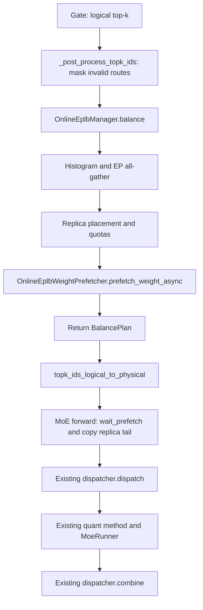

# 融入 MoE Forward 的全局 Online EPLB 设计

当前 GPU planning 方案见 [Online EPLB GPU Planning 设计](DESIGN-online-eplb-gpu-planning.md)。2026-10-08 已决定仅保留 GPU planning，并删除本次相关测试、CPU reference 和 benchmark 代码。本文后续 CPU 参考实现与测试描述属于历史设计；planner、BalancePlan、remap 与交付范围以专项设计为准。

| 项目 | 内容 |
| --- | --- |
| 状态 | 已按全局 manager + 统一 prefetcher 重构；当前仅保留 GPU planning，相关测试代码已删除，GPU 验证待完成 |
| 日期 | 2026-10-03 |
| 适用系统 | SGLang NVIDIA CUDA 推理路径 |
| 目标后端 | DeepEP 2.5 `EPBuffer` |
| 参考设计 | UltraEP 的 post-gating 实时复制、配额重路由与跨层副本存储复用 |
| 首期场景 | 单 NVLink 域内的 MoE prefill |

## 1. 摘要

参照 DWDP 的全局 manager 生命周期，建立 `OnlineEplbManager`。每个 MoE 层 gate 完成后，在 `topk.py::_post_process_topk_ids` 中调用 `manager.balance(...)`：汇总当前 token 的 logical top-k 信息，执行 EP all-gather，生成副本布局与整数配额，并调用统一的 `OnlineEplbWeightPrefetcher.prefetch_weight_async(...)` 发起权重预取。

`balance` 返回调用级路由上下文，由 `topk_ids_logical_to_physical` 完成唯一一次 logical → physical 映射。随后走已有的 `dispatcher.dispatch → quant_method.apply / MoeRunner → dispatcher.combine`，在 forward 的依赖边界等待预取并释放调用资源。DeepEP 2.5 buffer 提供 prefetcher 的首个实现。

目标架构不保留单独的 `OnlineExpertRunner` 或另一套 online forward。Manager 管理决策和生命周期，prefetcher 管理权重搬运，现有 MoE 执行后端消费 master/replica 权重视图。

各层的原始专家权重持续驻留，冗余权重缓冲区跨层复用。该设计同时降低单层 rank 间的计算不均衡，并控制冗余专家的显存成本。

本文中的“逐层”指每层根据自己的实际 gate 结果独立决策。“跨层”指 DeepEP 副本暂存区复用，各层计算用副本存储独立，不表示将不同层的专家互换，也不表示使用第 L 层的负载代替第 L+1 层的真实负载。

## 2. 背景与现状

### 2.1 当前 SGLang

当前仓库的 `ep_num_redundant_experts` 默认值为 0，表示每层在整个 EP group 中增加的物理专家总数。普通 EP 路径按以下公式分配：

```text
physical_experts = logical_experts + redundant_experts
local_physical_experts = physical_experts / ep_size
```

现有 EPLB 管理专家布局和权重更新；LPLB 可根据当前负载在已有副本布局上求解分流概率。这些机制可提供统计与 collective 调用的参考，但不直接提供本方案的逐层临时复制和共享副本池。

`deepep_v2.py` 使用 `ElasticBuffer`；独立的 `deepep_v2_5.py` 使用 `EPBuffer`，通过 `--moe-a2a-backend deepep_v2.5` 选择，并复用 v2 的数据布局与 runner 适配。DeepEP 2.5 的接口拆分见 [DeepEP 版本说明](https://github.com/deepseek-ai/DeepEP#news)。

### 2.2 参考思想

UltraEP 在每个 microbatch、每层 gate 之后，根据当前负载决定专家复制与 token 重路由，并复用跨层副本缓冲区。本方案参考该分工，使用 DeepEP 承担副本权重通信，不假设直接复用 UltraEP 的完整运行时或性能结果。[UltraEP 接口与集成说明](https://github.com/Dots-Infra/UltraEP#interface)

## 3. 目标与范围

### 3.1 目标

1. 降低 prefill 中最慢 EP rank 的 MoE 执行时间。
2. 保持原始 logical expert 选择及 top-k 权重不变。
3. 每条有效 `(token, top-k position)` 路由项恰好执行一次。
4. 在固定副本容量内动态复制专家，避免运行时动态分配权重存储。
5. 支持跨层复用副本显存，并明确 CUDA stream、事件和调用状态的所有权。
6. 无收益时使用 master-only 路由，保证控制流一致。

### 3.2 首期约束

| 维度 | 首期范围 |
| --- | --- |
| 拓扑 | EP group 位于单 NVLink 域内 |
| 阶段 | Prefill；decode 使用 master-only 路径 |
| 专家划分 | 每 rank 相同数量的 master experts，MoE TP=1 |
| 权重格式 | 各层使用兼容的 `Fp8MoEMethod` `[128,128]` block-FP8 权重/scale 布局与相同通信配置 |
| 专家布局 | 固定、连续的 master placement |
| 并发 | 单个在途 MoE 调用；关闭 TBO 和其他重叠 MoE 调度 |
| Shared experts | 独立计算，不融合到 routed-expert physical slots |
| 图执行 | Active prefill 使用 eager；inactive decode 使用 expanded/master-only CUDA graph 路径 |

首期不支持训练反向传播、elastic EP、LoRA 专家适配、静态冗余布局与在线模式叠加。启动时对不支持的组合明确报错。

## 4. 术语与编号模型

| 符号 | 定义 |
| --- | --- |
| E | 每层 logical expert 数 |
| P | EP rank 数 |
| M | 每 rank 的 master expert 数，M=E/P |
| R | 每 rank 的动态冗余槽数 |
| S | 每 rank 的 physical slot 数，S=M+R |
| D | 一个 NVLink 域中的 rank 数 |
| N | 当前调用中的有效路由项总数，通常为有效 token 数乘 routed top-k |

首期要求 E 能被 P 整除。每 rank 的 physical slots 布局固定：

```text
local slots [0, M)   : master experts
local slots [M, M+R) : dynamic replicas
```

### 4.1 Logical ID

Gate 输出 `[0, E)` 的 logical IDs。在连续 master placement 下：

```text
owner_rank(e) = e // M
master_local_idx(e) = e % M
```

后续支持非连续布局时，使用显式 owner/local-index 表，禁止继续使用上述整除公式。

### 4.2 Dispatch physical ID

```text
master_physical_id(e) = owner_rank(e) * S + master_local_idx(e)
replica_physical_id(target_rank, slot) = target_rank * S + M + slot
dispatch_num_experts = P * S
```

Master-only 回退仍使用上述 physical ID，并保持 `dispatch_num_experts` 不变。存在副本槽时，logical ID 通常不等于 master physical ID。

### 4.3 Prefetch source ID

`redundancy_mapping` 中的编号使用 NVLink 域内 master 布局：

```text
prefetch_source_id = domain_local_owner_rank * M + master_local_idx
```

它与 EP-global rank 编号、dispatch physical ID 分开管理。跨域扩展必须显式维护 EP rank 与 domain-local rank 的转换表。

### 4.4 示例

E=256、P=8、R=4 时，M=32、S=36，传给 dispatch 的 expert 数是 288。

若把 logical expert 7 复制到 rank 3 的副本槽 0，在单域连续 rank 布局下：

```text
redundancy_mapping[3, 0] = 7
replica_physical_id = 3 * 36 + 32 = 140
```

不能将 140 写入 `redundancy_mapping`。即使当前调用没有创建副本，dispatch expert 数仍是 288。

## 5. 系统架构

### 5.1 全局 manager 与职责边界

“全局”指每个 worker/runtime 中、当前模型及 EP group 共享一个 manager；各 EP rank 各有本地实例，通过 collective 获得一致输入并独立生成相同计划，不增加中心服务。PP worker 仅注册自己持有的层，后续多模型场景必须按 runtime/model 隔离。

| 组件 | 职责 |
| --- | --- |
| `OnlineEplbManager` | 构造初始化、`balance(layer)` 编排、top-k 统计 all-gather、规划、调用状态、预取等待及释放 |
| `OnlineExpertBalancer`（内部策略） | 根据共同 counts 计算 placement、quota；保留可测试的策略实现，不拥有 dispatcher 或 runner |
| `OnlineEplbWeightPrefetcher` | 统一权重预取协议，屏蔽后端 buffer、事件和资源差异 |
| `DeepEPv25Buffer` | 在 runtime state 中统一管理一个 prefetcher、`EPBuffer` 和副本池；`get_prefetcher()` / `get_buffer()` 共享资源 |
| 共享 replica tensors | prefetcher 一次分配，各层按计算 stream 顺序复用 |
| 当前 MoE layer | 通过 `balance(layer, ...)` 提供当前 master 参数；权重更新在 forward 边界同步 |
| `topk_ids_logical_to_physical` | 消费调用级在线计划，按 source prefix 与 ordinal 精确映射 |
| 现有 quant method / `MoeRunner` | 消费当前层完整 FP8 权重，执行原有 FC1、激活、FC2 和输出处理 |

Manager 不执行 GEMM，不创建第二套 runner，不把整个 forward 封装成新的执行入口。Dispatcher 不统计负载、不规划、不再次改写正常 token 的 top-k。

### 5.2 初始化与销毁

参考 [DwdpManager](python/sglang/srt/layers/moe/dwdp/dwdp_manager.py) 的资源生命周期和 runtime 全局 getter/setter，新增 `get_global_online_eplb_manager()`、`set_global_online_eplb_manager()`；同时覆盖 runtime 状态的备份、恢复与 reset，避免测试或模型重建遗留单例。

1. 模型权重加载及 post-load transforms 完成后、KV-cache 容量规划和图捕获之前，由 `ModelRunner.maybe_init_online_eplb_manager()` 构造 `OnlineEplbManager(model)`。构造函数直接完成校验与资源初始化，无单独的 manager setup 接口；初始化失败时释放已取得的 prefetcher。
2. 构造期间临时遍历 MoE 层，校验 master placement、dtype、runner 和通信拓扑。Manager 不保存 model/layer 引用或层注册表，只保存共享配置、balancer、prefetcher 与调用状态。Qwen3 MoE 的 DeepEP forward 显式传入 `moe_layer=self.experts`，经 TopK / select_experts 传递到 post-process，不在 TopKConfig 中保存层引用。`ExpertLocationDispatchInfo.init_new()` 在在线模式返回 `online` algorithm，普通及空 token 路径都进入 `_post_process_topk_ids` 的 online 分支并调用 `balance(layer, ...)`。首期只接入 Qwen3 MoE，其他模型暂不改动。
3. Manager 从 runtime 获取实际使用的 TP 通信组（当前要求 MoE TP=1），只创建一个 balancer。Manager 使用 runtime 通信组及 layer 的 hidden size、top-k 调用独立工厂 `get_online_eplb_weight_prefetcher()`，按配置选择后端；buffer getter 校验通信配置，prefetcher 的 `validate_weights()` 校验跨层权重布局。全部通过后才调用一次 setup 分配副本暂存区与 LB region；验证或分配失败统一 cleanup。Manager 不访问 dispatcher `_impl`、不导入具体 buffer 类，也不保存 `shared_layout/layout` 混合配置。Dispatcher 通过原有 `get_buffer()` 取得同一个 `EPBuffer`，无需逐层 bind/unbind。LB region 必须在首次 dispatch 前确定，不能在首次 gate 时临时扩容。
4. 热更新 master 权重时先排空在途调用；`balance(layer, ...)` 每次直接读取 layer 当前参数，Parameter 的原位加载会更新完整存储的 master 前缀；若替换 Parameter 存储或重新转换格式，需重新初始化完整存储，并重新捕获图。格式变化需重建 manager 和共享资源，禁止长期缓存已被替换的参数 tensor。
5. `cleanup()` 等待尚未结束的传输和计算，再按资源所有权释放 pool/buffer 并清空全局引用。普通 runtime reset 不能直接丢弃在途对象。

DWDP 提供生命周期组织方式；online EPLB 使用本层刚产生的真实 gate 结果，不能沿用 DWDP 的“提前预取下一层”时序。首期不支持与 DWDP 同时启用。

### 5.3 执行依赖



`prefetch_weight_async` 提交传输后即可返回；映射不读取副本权重，可与传输重叠。首期在 dispatch 之前等待预取，后续仅在确认通信 stream 允许重叠后才将等待和尾部复制推迟到 GEMM 前。异步 API 本身不构成重叠保证。

### 5.4 调用级状态

Manager 的 `forward_scope()` 设置本次 forward 的统一 `active` 开关，正常模型执行与启动 warmup 都经过此入口。层按顺序执行，`balance(layer, ids)` 直接返回 `BalancePlan` 给 TopK 映射；manager 只保留一个预取 ticket，不维护调用标识、调用状态机或权重版本。空 token rank 也必须遵循相同层顺序。权重更新必须与 forward 串行化。

`balance` 返回上下文供映射函数显式消费，同时将其登记到当前调用作用域，供随后的 MoE forward 等待和完成。不得依赖跨 batch 的 `last_plan`，也不能只按 `layer_id` 读取“最近一次”计划。首期只允许单个在途 MoE 调用；重复 balance、未映射即 dispatch、重复映射或错误调用 key 都必须报错。

## 6. 负载统计与规划算法

### 6.1 负载统计

每个 source rank 统计 logical expert histogram：

```text
local_counts[e] = 当前 rank 发往 expert e 的有效路由项数
counts[s, e] = source rank s 对 expert e 的路由项数
global_counts[e] = sum_s counts[s, e]
```

这些操作全部由 `OnlineEplbManager.balance` 编排：从本 rank 的 token logical top-k 构造 histogram，再执行 EP-wide all-gather 得到 `counts[P, E]`，不能推迟到 dispatcher 或 runner。

这里 all-gather 的是 token top-k 的逐 expert 计数信息。当前配额算法只需要共同 counts 和本地 top-k 顺序，因此无需传输变长的完整 `[tokens, top_k]` IDs、router logits 或 top-k weights；本地 IDs 仍用于计算每条路由项的 ordinal。该矩阵同时提供规划需要的总量和精确重路由需要的 source-rank 前缀，元数据规模为 O(P×E)。若后续策略需要逐 token 全局信息，再扩展元数据协议。

统计必须排除 padding、`-1` 路由、通信占位 dummy token 和独立 shared expert 路由。在线分支必须在 balance **之前**应用 `num_token_non_padded` 和无效路由 mask，不能沿用“先 remap 再 mask”的顺序。空 token rank 提交全零 histogram，并继续参加所有规定的 collective。

Counts 必须对应每个 source rank 实际将 dispatch 的 token shard；若某模型在 EP ranks 上复制同一批 top-k，需先明确唯一 source ownership，不能把重复输入当作独立负载。统计后直到映射完成，不得再重排、增删有效路由项。

### 6.2 规划输出

概念数据结构如下；实际实现可用定长稀疏表减少显存和 kernel 开销：

```text
BalancePlan:
  invocation_id                  # 当前 MoE 调用标识
  layer_id                       # 当前层
  redundancy_mapping[D, R]        # int32；-1 表示未使用
  instance_physical_ids[E, C]     # 各 expert 的 master/replica physical IDs
  instance_quotas[E, C]           # 各实例的整数 token 配额
  source_prefix[P, E]             # source rank 之间的路由项前缀
  replicate                      # 是否采用副本；False 仍须映射 master physical IDs
```

`C` 为实现预留的每 expert 最大实例数。容量必须覆盖允许的复制数；若设较小上限，planner 必须将其作为硬约束。

### 6.3 首期算法

采用确定性的 quota-driven 贪心算法：

1. 将每个 expert 的全部配额分给 master，计算各 rank 的初始负载。
2. 在同一 NVLink 域中选择过载 rank 和有空闲副本槽的轻载 rank。
3. 从过载 rank 选择一个可降低预计最长执行时间的热点 master expert。
4. 在目标 rank 建立该 expert 副本，将一部分整数配额转移到副本。
5. 更新负载与副本槽使用情况，重复直到没有正收益候选或容量耗尽。

相同输入必须产生相同计划；候选平局按固定 rank/expert/slot 顺序处理。首期保持 master 源位置稳定，不进行副本到副本的级联复制。

### 6.4 规划约束

- 每 rank 最多占用 R 个副本槽。
- 每条副本映射必须指向同 NVLink 域的其他 rank 的 master expert。
- 每个 expert 的实例配额之和必须等于 `global_counts[e]`。
- 配额必须非负，未使用副本配额为 0。
- 每个有效 physical ID 必须小于 P×S。
- 每次搬运量、单 expert fan-out 和最小副本 token 数可作为可调限制。
- 若无可行的有收益计划，生成 master-only 计划。

### 6.5 成本模型

首期可以使用 rank token 数近似 GEMM 成本，但是否启用复制必须考虑暴露开销。后续按模型、dtype、runner 和 batch 范围标定：

```text
T_base = predicted_makespan(master_only)
T_online = T_metadata + T_plan + T_reroute
         + T_prefetch_exposed + predicted_makespan(plan)
         + T_additional_runner_and_dispatch_overhead

enable_replication if T_base > T_online + safety_margin
```

预测计算成本应考虑每 expert token 数、GEMM tile 对齐、额外小 GEMM 和通信去重变化。不能将 token max/mean 改善直接等同于延迟收益。

由于精确负载在统计后才可得，放弃复制的调用仍有元数据开销。后续可在所有 ranks 一致可见的 batch 元数据上增加早期门控，避免小 batch 进入在线路径。

## 7. 精确 token 重路由

对 expert e 的每条有效路由项计算全局 ordinal：

```text
ordinal(s, e, item) = sum_{u < s} counts[u, e]
                    + local_ordinal(s, e, item)
```

`local_ordinal` 按固定 `(token index, top-k position)` 次序生成。根据各实例 quota 的累积区间，选择唯一 physical ID。

例如 expert e 的 master 和两个副本配额分别是 `[600, 300, 100]`：

```text
ordinal [0, 600)    -> master
ordinal [600, 900)  -> replica 0
ordinal [900, 1000) -> replica 1
```

重路由在 `topk_ids_logical_to_physical` 的 online 分支完成，仅改写 expert ID，不改变 top-k 位置、权重或 logical expert 的计算语义。首期不采用独立随机采样副本的方式，避免实际 token 数偏离规划。

接口增加 keyword-only 的 `online_plan`，在 `ExpertLocationDispatchInfo` 的 online algorithm 分支内完成映射：

```python
def topk_ids_logical_to_physical(
    topk_ids, info, log2phy_prob=None, *, online_plan=None
):
    if info is None:
        return topk_ids
    if info.ep_dispatch_algorithm == "online":
        manager = get_global_online_eplb_manager()
        if online_plan is None:
            return manager.balancer.master_ids(topk_ids)
        return map_online_routes(topk_ids, online_plan, manager.balancer)
    return existing_static_dynamic_or_lp_remap(topk_ids, info, log2phy_prob)
```

Online 模式下 `ExpertLocationDispatchInfo.init_new` 返回 algorithm 为 `online` 的描述，无静态映射表。Active 路径直接传入本层 plan，inactive 路径执行可捕获的 master 映射。映射函数不保存调用状态、不进行 collective 或预取。

`map_online_routes` 必须满足：

- 先判断有效性，再做安全索引；`-1` 保持 `-1`，不能索引映射表最后一项。Padding 不参与 ordinal。
- 无副本、decode 以及统一门控回退都使用 `owner_rank(e) * S + master_local_idx(e)`；`replicate=False` 不等于 identity mapping。
- 输出保留输入的 shape、整数 dtype、设备和 top-k 列顺序。Logical routed-expert capture 在映射前，physical distribution recorder 在映射后；录制元数据的容量须覆盖 `P*S`。
- Dispatcher 接收的正常 `StandardTopKOutput.topk_ids` 已经是 physical IDs，禁止第二次转换。若 dispatcher 为通信生成 dummy 路由，其 ID 也必须使用 master physical 编码，权重为零且不计入真实配额。


## 8. 权重布局与 GEMM 接入

### 8.1 存储布局

每层在 `Fp8MoEMethod.create_weights()` 中预留完整的 master + replica 存储；所有层共用 DeepEP 预取暂存区：

```text
Per layer:
  w13[M+R, 2I, H]
  w2[M+R, H, I]
  w13_scales[M+R, ...], w2_scales[M+R, ...]
  原 Parameter 是上述存储的 [:M] 视图

Shared EPBuffer LB region:
  replica_w13[R, ...], replica_w2[R, ...]
  replica_w13_scales[R, ...], replica_w2_scales[R, ...]
```

`FusedMoE.__init__` 在 checkpoint 加载前调用 `Fp8MoEMethod.create_weights()`，分配 M+R 权重及 FP32 scales，再将原 Parameter 缩为前 M 个 expert 的视图；保持加载元数据，尾部不参与 checkpoint 加载。仅 routed block-FP8 层预留空间，shared／非 online 路径不扩容。

Post-load 若执行 UE8M0 requant，`reserved_experts=R` 使输出权重与 packed scales 保留 M+R 容量，但只转换 M 个已加载 expert。转换返回前 M 个 expert 的视图；`_update_online_expert_weight_views()` 用 `as_strided` 建立完整存储视图，不复制 master。无需转换时直接复用初始存储。Manager 只校验最终布局与容量并创建通信资源，不再分配或扩展层权重。此流程在 KV cache 规划和图捕获前完成。

每次预取完成后，将共享区四组 tensors 复制到当前层 `[M:M+R]`，不在 forward 中拼接或搬运 master。各层各有 R 个常驻副本槽，额外显存为各层副本大小之和，加上一份共享暂存区。相比共享副本直接计算，增加一次本地 D2D copy，换取常规单次前后处理。

### 8.2 统一 `OnlineEplbWeightPrefetcher` 基类

统一 Python 抽象接口如下；`PrefetchTicket` 是后端无关的等待句柄，ticket 持有共享 replica tensor views：

```python
class OnlineEplbWeightPrefetcher(ABC):
    @abstractmethod
    def validate_weights(self, layer_weights): ...  # 不分配 GPU 存储

    @abstractmethod
    def setup(self, layer_weights, *, slots_per_rank): ...

    @abstractmethod
    def prefetch_weight_async(
        self, *, layer_weights, redundancy_mapping
    ) -> PrefetchTicket: ...

    @abstractmethod
    def wait_prefetch(self, ticket, *, consumer_stream): ...

    @abstractmethod
    def cleanup(self): ...
```

EP group 与通信容量在创建具体 prefetcher 时绑定。`layer_weights` 包含本次所需的全部 master weights/scales，ticket 暴露共享 replica tensor views。`prefetch_weight_async` 只搬运指定权重，不读取 top-k、不选择副本、不计算 GEMM。Manager 决定调用顺序，并持有 ticket 和输入引用直至异步读取结束；prefetcher 封装事件类型、stream 依赖及完成等待。所有层串行复用同一份 replica tensors；不再引入 acquire/release 或 bank lease。

### 8.3 DeepEP 2.5 buffer 实现

在 `deepep_v2_5.py` 中让 `DeepEPv25Buffer` 实现 `OnlineEplbWeightPrefetcher`。`get_prefetcher(...)` 为 classmethod，在现有 runtime buffer state 中缓存一个 prefetcher；独立工厂内部调用该 getter；Manager 只保存基类引用，不维护各层注册信息，也不通过 dispatcher 获取 prefetcher。Dispatcher 沿用原有 `_get_buffer()`，通过同一 state 取得 `EPBuffer`。

初始化时用 `BufferAllocator` 规划共享 replica tensors，以 `lb_allocation_plan_or_num_bytes` 构造 `EPBuffer`。各 rank 的分配顺序一致；不兼容层在分配前报错。已有普通 buffer 未预留 LB region、或 online buffer 的通信参数发生变化时直接报错，必须先 cleanup 再显式初始化，getter 不隐式重建资源。

Dispatcher 在构造时记录 master 数 M，并根据 `enable_online_eplb` 和 R 设置 physical 数 `M+R` / `P*(M+R)`、非 expanded 布局及 dummy ID 编码。这些布局信息不通过绑定 prefetcher 来更新。后续若支持多种权重格式，应在单个 prefetcher 内扩展存储管理。

`prefetch_weight_async` 将 共享 replica 目标 tensors、当前层源 tensors 和 domain-local `redundancy_mapping` 传给 `EPBuffer.lb_prefetch_weights`，并把返回的 `EventOverlap` 封装为 ticket。源/目标须满足连续性、每 expert 字节数与对齐要求，目标必须位于该 buffer 的 LB region；mapping 为域内一致的 int32 `[D, R]`。[DeepEP 固定版本接口](https://github.com/deepseek-ai/DeepEP/blob/93eb6eb238127e96c6d7a4a625a6dad158348509/deep_ep/buffers/ep.py#L778)

实现固定使用 `previous_event=None`，DeepEP 等待当前计算 stream，保证上一层副本读取、mapping 和 master weights 就绪后才预取；`wait_prefetch` 再把完成依赖连接到消费 stream。不能把 `previous_event` 误当成输出事件，也不能只记录 Python 调用已返回。

### 8.4 现有 MoE 计算路径消费权重

保留 `FusedMoE.run_moe_core → Fp8MoEMethod.apply → MoeRunner`。Dispatch 前执行 `manager.wait_prefetch(layer)`：先等待通信事件，再在当前消费 stream 上复制 replica 权重及 scales 到该层尾部。

Active 时 quant info 使用该层完整 M+R 权重和 scales，沿用一次 pre-permute、常规 FC1/激活/FC2、一次 post-permute 和 combine。无需组内 ID rebasing、结果相加或分段 runner；`ExpertWeightView` 和 `segmented.py` 已移除。DeepEP v2 pre-permute 按实际 prefix sums 构造 expert 行布局，GEMM 按完整权重 tensor 获取专家维度。

Inactive 时使用原 Parameter 的 M-expert 视图，dispatcher 只向计算提供 master prefix sums。Decode 保留 expanded/masked master-only 路径，权重地址在 graph capture 前固定。

## 9. 同步、生命周期与正确性

### 9.1 Collective 规则

`lb_prefetch_weights` 是 NVLink 域内 collective；域内所有 ranks 均须调用，包括无 token 或无副本的 ranks。域内 mapping 内容必须一致，未使用槽设为 -1。[DeepEP LB collective 约束](https://github.com/deepseek-ai/DeepEP/blob/93eb6eb238127e96c6d7a4a625a6dad158348509/deep_ep/buffers/ep.py#L778)

首期进入在线决策的 prefill 调用固定执行一次 counts all-gather 和一次 prefetch；空复制计划使用全 -1 mapping。无本地输入的 rank 仍可能承接远端 token、存放副本或提供 master 权重，不能跳过任何一步。

`manager.active` 在 `forward_scope(forward_batch)` 入口确定，在整个 forward 内保持不变，正常结束或异常时恢复 False。使用全组一致的 extend 标记与原始全局 token 数之和判断是否达到 `online_ep_min_forward_tokens`；无 DP metadata 时使用共享输入 batch 的 token 数。空 rank 跟随全组决策。默认阈值为 1，允许配置调高。

Inactive prefill 和 decode 都不创建预取 ticket，不执行 counts all-gather、预取、wait 或尾部复制。TopK 仍按 `M+R` 槽位布局映射 master IDs；dispatcher 只向计算路径提供前 M 个 master 专家的 prefix sums，原生 combine handle 保持完整。Decode 使用 expanded/masked FP8 master-only GEMM；inactive prefill 使用 non-expanded master-only GEMM。

### 9.2 临时数据与异步生命周期

执行顺序由 MoE forward 保证：balance → map → wait → tail copy → GEMM → combine。Manager 不额外维护调用状态机。

| 资源 | 最短有效期 |
| --- | --- |
| Master 权重 | 所有读取这些权重的传输与 GEMM 完成之前 |
| Replica 权重和 scales | Prefetch 开始至最后一个消费 GEMM 完成 |
| Redundancy mapping | Prefetch 完成之前 |
| Physical top-k、dispatch handle | 对应 combine 完成之前 |
| 调用级配额与前缀 | 重路由及相关异步读操作完成之前 |

MoE forward 在 dispatch 前等待预取并复制尾部，后续 GEMM 和 combine 沿用当前 stream 的依赖链。下一层预取默认等待当前 stream，保证共享暂存区不在上一层 D2D copy 读取结束前被覆盖。Manager 保留一个 ticket，下一次成功预取替换它；cleanup 先同步再释放。不引入 finish、acquire/release 或调用状态机。异常路径保留在途资源等待统一 cleanup。

同层多 batch、TBO 或其他多在途场景必须拥有独立调用状态与足够的 pool banks。Pool bank 数由同时消费副本存储的调用数决定，不机械等同于 PP stage 或 microbatch 总数。

### 9.3 数值与失败行为

复制不改变 logical expert 和 routing weights，数学计算保持等价；GEMM 分组和归约顺序可能带来 dtype 容差内差异，不承诺 bitwise 等价。

无收益是正常回退条件。非法 mapping、权重未 ready 或 collective 失败属于执行错误，不允许某一 rank 单独切换路径继续运行。调试模式在通信前验证计划一致性与编号范围；运行时错误遵循现有分布式任务失败处理。

## 10. Forward 接口草案

以下为调用关系伪代码，省略错误校验和既有模型输出处理；具体实现见第 18 节。

### 10.1 Top-k post-process 发起 balance

```python
# 在统一的 _post_process_topk_ids 中按 dispatch algorithm 分支。
manager = get_global_online_eplb_manager()
if expert_location_dispatch_info.ep_dispatch_algorithm == "online":
    assert manager is not None  # 启用但未初始化是错误，不能回退成 identity。
    logical_ids = mask_invalid_routes(topk_ids, num_token_non_padded)
    capture_logical_routes(logical_ids, layer_id)
    online_plan = (
        manager.balance(moe_layer, logical_ids) if manager.active else None
    )
    physical_ids = topk_ids_logical_to_physical(
        logical_ids, info=expert_location_dispatch_info, online_plan=online_plan
    )
    # online 分支完成后不再执行已有 remap；保留 top-k weights 原值。
    return physical_ids, topk_weights, physical_ids
# 后续为已有非 online post-process。
```

`balance` 完整负责统计通信、决策和预取提交：

```python
def balance(self, layer, logical_topk_ids):
    assert self.active
    local_counts = histogram(logical_topk_ids, self.balancer.num_experts)
    counts = all_gather(local_counts, group=self.ep_group)
    plan = self.balancer.plan(counts)
    self._prefetch_ticket = self.prefetcher.prefetch_weight_async(
        layer_weights=self._current_weights(layer),
        redundancy_mapping=plan.redundancy_mapping,
    )
    return plan

```

启用状态来自本次 forward 的统一 `manager.active`，不在 gate API 中透传后端 `EPBuffer` 或模型权重参数。CPU 参考 planner 可作为迁移第一步保留，其同步成本需显式测量，后续在同一接口下替换为 GPU planner。

### 10.2 沿用 MoE forward

```python
# FusedMoE.forward_impl；已有的 TopKOutput 此时已包含 physical IDs。
manager = get_global_online_eplb_manager()
if get_exec().moe.enable_online_eplb and not self.is_shared_fused_moe and manager.active:
    manager.wait_prefetch(self)  # 等待并复制到本层 replica 尾部。

dispatch_output = self._dispatch_with_pre_quant(
    hidden_states, topk_output, pre_quant_input
)
# 常规 quant method 在 active 时使用完整 M+R 存储，否则使用 M-expert Parameter。
combine_input = self.run_moe_core(dispatch_output)
final_hidden_states = self.dispatcher.combine(combine_input)
return existing_output_processing(final_hidden_states)
```

`run_moe_core` 继续调用 `self.quant_method.apply(...)`。Dispatcher 只处理正常 dispatch/combine；不调用 `prepare()`，不拥有 manager 生命周期，也不在 combine 内释放某个 online runner 的池。

### 10.3 空输入及其他 top-k/forward 入口

- `TopK.empty_topk_output` 目前绕过 `_post_process_topk_ids`。在线模式须携带真实 `layer_id` 和调用 key，显式传入 `moe_layer` 与 `online` dispatch info，以 `[0, routed_top_k]` IDs 进入统一的 `_post_process_topk_ids`，执行一次 balance 和映射；禁止再从 dispatcher 补跑一次 balance。
- 无 token rank 仍进入 MoE dispatch/GEMM/combine，接收并处理其他 ranks 发来的 token。通信 dummy 只能在统计后创建。
- Precomputed top-k、custom routing、native top-k、packed top-k 和融合 gate+MoE 路径要逐一审计。在线模式只开放能在 logical top-k 物化后进入该 helper 的路径；packed IDs 必须在映射后生成，或首期禁用该格式，不能携带旧 logical packed IDs。
- Waterfill 等会改变有效路由集合的后处理必须移到 balance 之前，或在首期在线模式中禁用；不能在生成配额后再次修改 token 到 expert 的分配。
- 首期禁止绕过共同 hook 的 deferred finalize、TBO/SBO、torch.compile 及 fused forward。后续支持时必须补齐同一预取依赖链的 wait/copy，不能另建 online forward。
- Logical capture 与 physical recorder 各调用一次；无静态布局元数据时，在线 recorder 使用本次 layout，不能把动态副本归属写成永久 expert location。

## 11. SGLang 改动范围

| 文件或模块 | 目标改动 |
| --- | --- |
| 新增 `eplb/online_eplb_manager.py` | `OnlineEplbManager` 的构造初始化、balance(layer)、wait、尾部复制、cleanup 与临时预取 ticket |
| 新增 `eplb/online_eplb_weight_prefetcher.py` | `OnlineEplbWeightPrefetcher`、ticket 与共享 replica views 协议 |
| [runtime_context.py](python/sglang/srt/runtime_context.py) | 全局 manager getter/setter 与状态隔离、reset 生命周期 |
| [model_runner.py](python/sglang/srt/model_executor/model_runner.py) | 权重变换后 setup，替换逐层 online runner 初始化，销毁时 cleanup |
| [topk.py](python/sglang/srt/layers/moe/topk.py) | `_post_process_topk_ids` 中 mask → balance → remap；补齐 empty/precomputed 路径 |
| [expert_location_dispatch.py](python/sglang/srt/eplb/expert_location_dispatch.py) | 在 online algorithm 分支处理 `online_plan`，统一精确 quota 映射 |
| [online_balancer.py](python/sglang/srt/eplb/online_balancer.py) | 保留内部 planner；统计 collective 的调用责任归 manager，reroute 归统一映射入口 |
| [deepep_v2_5.py](python/sglang/srt/layers/moe/token_dispatcher/deepep_v2_5.py) | 独立工厂与 dispatcher 分别使用 Buffer 共享 getter；prefetcher 负责权重布局校验，无逐层绑定 |
| [fused_moe_triton/layer.py](python/sglang/srt/layers/moe/fused_moe_triton/layer.py) | forward 增加 wait/copy，删除 `_online_expert_runner` 特殊执行分支 |
| 现有 quant method、`moe_runner/runner.py` 与 DeepGEMM 后端 | 完整 M+R 权重与常规 GEMM；沿用同一计算与输出处理链 |
| 模型加载、配置与 recorder | 区分 master 数 M、physical 数 S，拒绝未适配入口，记录动态 physical layout |
| 删除 `eplb/online_runner.py` | 将原有职责迁至上述常规组件后移除，不新增替代 runner |

现有 [LPLBSolver](python/sglang/srt/eplb/lplb_solver.py) 可作为空 rank 参与统计的参考，不直接复用其静态布局概率输出作为在线复制计划。

## 12. 配置与兼容策略

保留原型的参数方向；下表为目标配置，当前代码状态与迁移边界见第 18 节：

| 参数草案 | 含义 | 初始建议 |
| --- | --- | --- |
| `--enable_online_eplb` | 启用逐层在线复制 | 默认关闭 |
| `--online-ep-redundant-slots-per-rank` | 每 rank 的动态副本容量 R | 实验起点为 4；最终按模型和显存标定 |
| `--online-ep-min-forward-tokens` | 全局非 padding prefill token 启用阈值 | 默认 1，必须为正数 |
| `--online-ep-min-tokens-per-replica` | 防止过小副本计算 | 不预设通用阈值 |
| `--online-ep-min-gain-us`（未实现） | 预计净收益下限 | 后续通过压测标定 |

在线容量参数与现有 `--ep-num-redundant-experts` 分开，避免混淆全局、每 rank 和每层常驻存储语义。首期要求静态 redundant 数为 0，并禁用周期性 EPLB/LPLB 布局更新；与 DWDP、非 trivial master placement 互斥。启动校验必须拒绝未接通共同 top-k/forward hook 的后端。

Decode 或其他正常回退场景仍需将 logical IDs 转成预留副本槽布局中的 master physical IDs。Shared experts 在首期保持独立计算，后续若融合，需重新定义 slot 编码并扩展 dispatcher/runner 测试。

## 13. 多域与并发扩展

### 13.1 多 NVLink 域

统计覆盖整个 EP group，因为访问某个 expert 的 token 可能来自任意域。每个域只规划其 master experts 的域内复制，不能通过该原语把权重复制到其他域。

源 ranks 需要获得所有目标域的 replica placement 与 quotas，才能在 dispatch 前重写 physical IDs。实现可以使用全局 counts 上的确定性域规划，或在域内规划后交换计划；不能只在目标域保存 mapping。

域内复制不能消除域间总负载差异，验收时应同时报告全局不均衡和域内不均衡。

### 13.2 CUDA graph 与并发

Decode 图在 `manager.active=False` 下捕获和 replay；Python 分支在 capture 时固定。图内只执行静态 master ID 映射、expanded dispatch、master-only GEMM 和 combine，不依赖在线 plan 或预取 ticket。真实多 GPU capture/replay 仍需硬件验收。Active prefill 的 CPU 规划和 non-expanded 前处理暂不支持图执行。

并发扩展需同时隔离 pool bank、mapping、reroute 输出和 dispatch handle。双缓冲本身不提供下一层精确负载；同一序列的下一层 gate 仍依赖上一层输出。

## 14. 可观测性与验收

### 14.1 指标

| 类别 | 指标 |
| --- | --- |
| 端到端 | Prefill latency、吞吐、TTFT，以及尾延迟 |
| 负载 | 重路由前后 rank token max/mean、域内 max/mean |
| 计算 | 最慢 rank GEMM 时间、master/replica GEMM 分项时间 |
| 开销 | Histogram、collective、planner、reroute、prefetch 总时间与暴露时间 |
| 容量 | 已用 slots、复制字节数、单 expert fan-out、额外显存 |
| 策略 | 启用/回退比例及原因 |

Profile 默认采样，避免逐层 CPU 同步污染测量。端到端比较应包含在线统计与回退开销，并说明 R、模型、dtype、batch、拓扑和软件版本。

### 14.2 正确性测试

1. 单元验证 ID 编码、整数配额守恒、ordinal 区间覆盖及 slot 上限。
2. 分布式覆盖均匀负载、单热点、多热点、零 token rank 和全 -1 mapping。
3. 覆盖不同源 rank token 数、padding、非法路由屏蔽和空 dispatch 输入。
4. 使用不同层权重标记，验证连续层切换和重复 batch 不读取旧权重。
5. FP8 阶段逐项验证 weights、scales 和 packing；与无复制基线比较输出。
6. 多域阶段验证 domain-local ID 与 EP-global physical ID 转换。
7. 并发阶段人为延迟某个 stream，验证副本池与 handle 不被提前覆盖。
8. 使用 fake prefetcher 验证 setup → balance → prefetch → map → wait → tail copy → GEMM → combine 的顺序；验证跨层共享副本、临时输入生命周期，以及 inactive 路径不提交预取。
9. 验证 `info=None` 时 online 映射仍执行；decode/无收益计划都使用 master physical IDs，static/LP 不重复 remap，weights 保持不变。
10. 验证 empty top-k helper 每层参与恰好一次 all-gather/prefetch，padding 在统计前被屏蔽；无输入但收到远端 token 的 rank 正确计算。
11. 验证普通 `quant_method.apply` 和现有 runner 实际被调用，routewise finalizer/权重只应用一次，packed/融合入口按支持范围回退或拒绝。
12. 验证 master 权重更新、manager cleanup/re-setup 与 runtime reset 后无旧参数、旧 plan 或泄漏资源。

### 14.3 性能验收

在同硬件、同模型、同 batch 下比较无冗余基线、现有静态方案和本方案。偏斜负载必须呈现可重复的端到端收益；均匀负载与小 batch 的回退开销必须被量化并符合项目预先约定的预算。

不在设计阶段承诺统一加速比或延迟阈值。实际阈值由原型压测确定，不能以 token imbalance 降低替代性能验收。

## 15. 实施里程碑

| 阶段 | 交付物 | 退出条件 |
| --- | --- | --- |
| M0：资源与接口 | 锁定 DeepEP commit；全局 manager、prefetcher 基类与 buffer 实现；setup/cleanup | 同一 EPBuffer 服务 prefetch 和 dispatch，初始化早于 KV-cache 规划，无 forward 临时权重分配 |
| M1：主流程迁移 | post-process balance、统一映射、常规 forward hooks、现有 runner 完整权重 | 删除独立 online runner；固定计划 FP8 输出在容差内一致，空 rank 无死锁，回退 ID 正确 |
| M2：动态规划 | 迁移 counts all-gather 与 CPU 参考 planner，再替换为 GPU planner | 配额守恒，连续层无旧权重，热点场景端到端收益可重复 |
| M3：实用优化 | 成本门控、FP8、重叠优化与指标 | 净收益及回退开销达标，scales 验证通过 |
| M4：范围扩展 | 多域、图执行、其他 forward 入口及多在途 pool banks | 各扩展独立通过正确性、生命周期和性能验收 |

## 16. 待验证事项与风险

| 事项 | 验证方法或处理方式 |
| --- | --- |
| DeepEP 2.5 与当前 SGLang API 不兼容 | M0 锁定版本，验证构造、返回值、事件和依赖矩阵 |
| Prefetch/dispatch 同 stream 导致重叠有限 | 使用 GPU timeline 测量，不预估未经证实的隐藏收益 |
| FP8 权重及 scales 复制成本过高 | 先测单 expert 字节数与传输时间，再决定 R 和启用阈值 |
| 双组 GEMM 的 launch/布局适配成本 | 与指针表或双基址方案比较，保留正确性基线 |
| Packed/scaled 权重不能直接复用 | 在加载阶段建立 runner 支持的传输布局 |
| 贪心规划难以接近最优 | 用离线参考求解器评估差距，再改进 GPU planner |
| Collective 分支不一致 | 基于共同元数据决策；测试空 rank、零副本与回退 |
| 图执行或并发导致旧状态覆盖 | 固定地址、调用标识、pool banks 和完成事件 |

## 17. 参考资料

- [DeepEP：版本说明与 LB 接口](https://github.com/deepseek-ai/DeepEP)
- [DeepEP：EPBuffer 源码](https://github.com/deepseek-ai/DeepEP/blob/main/deep_ep/buffers/ep.py)
- [DeepEP：权重预取测试](https://github.com/deepseek-ai/DeepEP/blob/main/tests/ep/test_prefetch_weights.py)
- [UltraEP：设计、接口与集成示例](https://github.com/Dots-Infra/UltraEP)
- [SGLang：EP 参数定义](python/sglang/srt/arg_groups/fields/exec_.py)
- [SGLang：专家布局元数据](python/sglang/srt/eplb/expert_location.py)
- [SGLang：EPLB 管理器](python/sglang/srt/eplb/eplb_manager.py)
- [SGLang：DWDP manager 生命周期](python/sglang/srt/layers/moe/dwdp/dwdp_manager.py)
- [SGLang：Top-k post-process](python/sglang/srt/layers/moe/topk.py)
- [SGLang：逻辑到物理专家映射入口](python/sglang/srt/eplb/expert_location_dispatch.py)

未固定版本的上游链接仅作背景参考。本文的 DeepEP API 边界按 commit [`93eb6eb238127e96c6d7a4a625a6dad158348509`](https://github.com/deepseek-ai/DeepEP/tree/93eb6eb238127e96c6d7a4a625a6dad158348509) 核对 `EPBuffer`、`BufferAllocator`、`lb_prefetch_weights` 和事件接口，尚未完成该版本的 GPU 运行验证。UltraEP 仅作为设计思路参考，未引入其运行时代码。

## 18. 当前实现与验证边界

### 18.1 已完成的重构

| 组件 | 当前实现 |
| --- | --- |
| [online_eplb_manager.py](python/sglang/srt/eplb/online_eplb_manager.py) | 全局 manager；构造初始化、直接接收 MoE layer、调用作用域、histogram/all-gather、规划与预取编排、wait/copy/cleanup |
| [online_eplb_weight_prefetcher.py](python/sglang/srt/eplb/online_eplb_weight_prefetcher.py) | 统一基类、`PrefetchTicket` 和 `ExpertWeightBundle` |
| [deepep_v2_5.py](python/sglang/srt/layers/moe/token_dispatcher/deepep_v2_5.py) | 单个 prefetcher 与 dispatcher 共用 runtime 中的 EPBuffer；移除 bind/unbind，构造时确定 physical 布局 |
| [topk.py](python/sglang/srt/layers/moe/topk.py) / [expert_location_dispatch.py](python/sglang/srt/eplb/expert_location_dispatch.py) | Mask → balance → 统一映射；empty rank 进入同一 helper；禁用会绕过 balance 的预计算快速路径和 packed IDs |
| 现有 quant method / DeepGEMM | Active 使用完整 M+R 权重，inactive 使用 M-expert Parameter 视图；沿用原有 core |
| MoE forward / runtime | Dispatch 前 wait 并复制尾部；正常模型 forward 与启动 warmup 建立作用域；reset/restore 清理被替换的 manager |

已移除独立 online runner 和 segmented runner。每层持有 M+R 完整权重存储，共用一个 DeepEP 预取暂存区。层存储在 create_weights 时预留，post-load 保留容量并刷新完整视图；通信资源在 post-load 后初始化。权重更新在 forward 边界同步，替换底层存储时需保留容量、刷新视图并重新捕获图。

### 18.2 启用方式与限制

```text
--moe-a2a-backend deepep_v2.5
--deepep-v2-mode direct
--moe-runner-backend deep_gemm
--enable_online_eplb
--online-ep-redundant-slots-per-rank 4
--online-ep-min-tokens-per-replica 1
```

当前仍为单 NVLink 域、MoE TP=1、仅 `Fp8MoEMethod` 的 block-FP8 gated SiLU、无 bias/activation clamp、独立 shared experts、单个在途调用。通信容量须覆盖每 rank 的最大输入 token 数。Decode 使用 master-only expanded 路径，保留 decode CUDA graph 配置；prefill CUDA graph 仍禁用，拒绝 torch.compile。

现有 `expert_distribution_recorder_mode` 依赖静态布局表，暂不支持调用级副本归属，因此启动时拒绝与 online 同时启用；完善动态 physical recorder 元数据后再开放。Logical routed-expert capture 仍在映射前执行。

### 18.3 验证状态

本次新增 buffer 生命周期 CPU 验证，覆盖单实例 getter、prefetcher setup 幂等性、manager 构造初始化与失败清理、层兼容性校验、按调用读取当前层权重与调用内替换检测、prefetch/dispatch 共用 buffer、构造时 physical ID 布局、失败初始化、禁止隐式重建，以及 cleanup 后重新初始化。新增 online dispatch info、显式传层的统一 post-process、padding、空 rank all-gather 和 LP/static 分支回归覆盖；20 项测试在本地 CPU 隔离环境通过，native DeepEP/CUDA 操作使用 mock，TopK 控制流通过 AST 提取执行以绕过本地不可用的 GPU 导入。

此前 CPU 参考验证覆盖了跨 rank 配额守恒、Decode 映射、空 source 参与通信、调用生命周期及双组计算等价性。本地缺少 Triton/CUDA，真实 DeepEP 通信、CUDA event 时序、DeepGEMM kernel 和模型端到端输出/性能仍须在目标多 GPU 硬件执行第 14 节验收。

规划保留 CPU 贪心参考实现。其他量化格式、GPU planner、完整收益成本模型、active prefill CUDA graph、多 NVLink 域、TBO/SBO、speculative decoding 和其他融合入口仍属于后续范围；不宣称端到端加速。

本次 active 开关验证新增 CPU 验证，覆盖阈值、全局 token 数与空 rank、capture 禁用、异常复位、inactive 映射和 active 生命周期；本地 6 项通过。另以 CPU mocks 检查 expanded 布局选择及 master prefix 截取，尚未执行真实 CUDA Graph capture/replay。

## 19. Block-wise FP8 接入

首版接入 Qwen3 MoE 的 E4M3 `[128,128]` block-FP8，使用 FP8 dispatch 与现有 DeepGEMM 激活量化/scale 格式。Per-tensor FP8、MXFP8、FP4 和其他 block size 明确拒绝。BF16 dispatch 不与 FP8 专家权重混用。

Quant method 的 `get_online_expert_weights(layer)` 读取 post-load 后的 `w13_weight`、`w2_weight`、`w13_weight_scale_inv` 和 `w2_weight_scale_inv`，返回 `ExpertWeightBundle`。Bundle 固定包含这四张张量，仅支持 `[128,128]` block-FP8；构造入口校验 FP32 scales 的 block shape，或 UE8M0 scales 的 packed int32 shape 与 TMA stride。不接入 `UnquantizedFusedMoEMethod`；未量化模型在 manager 构造时拒绝。Manager 不持有层表，权重和 scales 的更新在 forward 边界同步，不做调用内版本检查。

`ExpertTensorLayout` 将每个 expert 的存储描述为对齐的连续传输 slab，同时保留计算 view 的 trailing shape/stride。连续权重与满足要求的 packed scales 直接创建 raw storage view；需额外 padding 的 scales 在当前 stream 生成对齐 payload。此过程不修改 scale 的编码，也不重新量化。Replica raw slabs 位于同一个 EPBuffer LB region，原生 buffer materialize 后再建立计算 views，所有层复用。

`prefetch_weight_async` 使用同一 redundancy mapping 传输四组 payload，ticket 持有 source bundle、临时 payload 和 replica bundle。`wait_prefetch(layer)` 将通信依赖接回消费 stream，再将四组副本复制到当前层完整存储尾部。FP8 quant method 在 active 时传完整 M+R 权重及 scales，inactive 时传原 Parameter。常规 DeepGEMM 路径完成一次前后处理，不再进行分组结果累加。

Inactive prefill/decode 的 expanded 布局选择、master prefix 截取、静态 M+R ID 映射与 CUDA Graph 策略不变。不再在 Manager 初始化时复制 master 来扩容；forward 仅复制 R 个副本及 scales。

本地 CPU 验证覆盖创建阶段容量预留、只转换 master 的 UE8M0 requant、重复 post-load、FP32/UE8M0 stride、Parameter 身份与 checkpoint shape、原位加载共享存储、四组 payload 预取与尾部复制，以及跨层副本隔离。原生 DeepEP/CUDA 使用 mock；实际通信、FP8 数值误差、D2D 开销及 CUDA Graph capture/replay 仍需多 GPU 验证。
